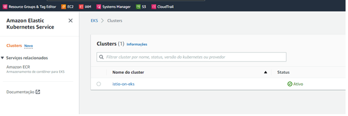
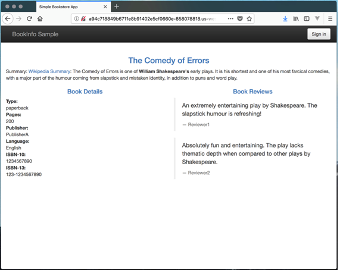

# Service Mesh with Isto Lab

## Preparation
* Launch an Ubuntu EC2 instance with an instance profile that has the EKS Full Administrator premission attached.
* SSH into the instance and run `ssh-keygen` to generate a SSH keypair. Hit the enter key to accept the default choices for generation of the key pair.

## Initial Setup

**1 – Follow the instructions below to install aws-cli (~2 minutes).**

```
mkdir EKSLAB ; cd EKSLAB
curl "https://awscli.amazonaws.com/awscli-exe-linux-x86_64.zip" -o "awscliv2.zip"
unzip awscliv2.zip
sudo ./aws/install
```

*If aws-cli is already installed on your system then do: 

```
sudo ./aws/install --update
aws --version
```

**2 – Installing kubectl (~2 minutes).**

```
curl -LO https://dl.k8s.io/release/$(curl -L -s https://dl.k8s.io/release/stable.txt)/bin/linux/amd64/kubectl
curl -LO https://dl.k8s.io/release/v1.22.0/bin/linux/amd64/kubectl
sudo install -o root -g root -m 0755 kubectl /usr/local/bin/kubectl
echo 'source > (kubectl completion bash)' >> ~/.bashrc
kubectl version --client --output=yaml
```

**3 – Installing eksctl (~2 minutes).**

For further information, see:[**https://docs.aws.amazon.com/eks/latest/userguide/eksctl.html**](https://docs.aws.amazon.com/eks/latest/userguide/eksctl.html)

```
curl --silent --location "https://github.com/weaveworks/eksctl/releases/latest/download/eksctl_$(uname -s)_amd64.tar.gz" | tar xz -C /tmp
sudo mv /tmp/eksctl /usr/local/bin
eksctl version
```

**4 – Setting up the EKS cluster in AWS (~10 minutes).**

```
eksctl create cluster --region us-east-1 --name istio-on-eks --nodes 2 --ssh-public-key "~/.ssh/id_rsa.pub" 
```



**5 - Setting up GO (~5 minutes).**

For further information, see: [https://go.dev/doc/install](https://go.dev/doc/install)

In your computer's CLI, type the follow commands:

```
 sudo rm -rf /usr/local/go
 curl --silent --location "https://dl.google.com/go/go1.18.2.linux-amd64.tar.gz" --output go1.18.2.linux-amd64.tar.gz
 sudo tar -C /usr/local -xzf go1.18.2.linux-amd64.tar.gz
 export PATH=$PATH:/usr/local/go/bin
 go version
 ```

**6 – After go has been installed, another binary must be installed using go (~10 minutes).**

```
go install sigs.k8s.io/aws-iam-authenticator/cmd/aws-iam-authenticator@master
```

**7 – Check the communication with EKS (~2 minutes).**

```
rm -f ~/.kube/config
aws eks update-kubeconfig --region us-east-1 --name istio-on-eks 
kubectl get nodes
kubectl get pods --all-namespaces
```

The output should look similar to the following 

```
[ec2-user@ip-172-31-86-160 EKSLAB]$ aws eks update-kubeconfig --region us-east-1 --name istio-on-eks
Added new context arn:aws:eks:us-east-1:690634326977:cluster/istio-on-eks to /home/ec2-user/.kube/config
[ec2-user@ip-172-31-86-160 EKSLAB]$ kubectl get nodes
NAME                             STATUS   ROLES    AGE   VERSION
ip-192-168-26-195.ec2.internal   Ready    <none>   10m   v1.22.6-eks-7d68063
ip-192-168-33-70.ec2.internal    Ready    <none>   10m   v1.22.6-eks-7d68063
[ec2-user@ip-172-31-86-160 EKSLAB]$ kubectl get pods --all-namespaces
NAMESPACE     NAME                      READY   STATUS    RESTARTS   AGE
kube-system   aws-node-5csqw            1/1     Running   0          10m
kube-system   aws-node-n84vg            1/1     Running   0          10m
kube-system   coredns-7f5998f4c-44gzz   1/1     Running   0          20m
kube-system   coredns-7f5998f4c-9q8t7   1/1     Running   0          20m
kube-system   kube-proxy-gb5rv          1/1     Running   0          10m
kube-system   kube-proxy-wkzzv          1/1     Running   0          10m
```

Once all settings above have been done, start HELM + TILLER + Istio setup.

## Setting up HELM + TILLER

**1 – Installing Helm (~2 minutes).**

For further information, see: [**https://v2.helm.sh/docs/using\_helm/#installing-helm**](https://v2.helm.sh/docs/using_helm/#installing-helm)

```
curl https://baltocdn.com/helm/signing.asc | sudo apt-key add -
sudo apt-get install apt-transport-https --yes
echo "deb https://baltocdn.com/helm/stable/debian/ all main" | sudo tee /etc/apt/sources.list.d/helm-stable-debian.list
sudo apt-get update
sudo apt-get install helm2
```

**2 - Creating a service account for Tiller's access (~5 minutes).**

```
vim rbac-config.yaml
```

Paste the follow and save:

```
apiVersion: v1
kind: ServiceAccount
metadata:
    name: tiller
    namespace: kube-system
---
apiVersion: rbac.authorization.k8s.io/v1
kind: ClusterRoleBinding
metadata:
    name: tiller
    roleRef:
        apiGroup: rbac.authorization.k8s.io
        kind: ClusterRole
        name: cluster-admin
    subjects:
        - kind: ServiceAccount
        name: tiller
        namespace: kube-system
```

Then execute the following commands:

```
kubectl apply -f rbac-config.yaml
helm init --service-account tiller --history-max 200
kubectl get serviceaccounts --all-namespaces | grep -i "tiller"
```

## Setting up ISTIO 

**1 – Installing ISTIO (~7 minutes).**

```
curl -L https://istio.io/downloadIstio | sh -
export PATH="$PATH:~/EKSLAB/istio-1.13.3/bin"
helm repo add istio [https://istio-release.storage.googleapis.com/charts](https://istio-release.storage.googleapis.com/charts)
helm repo update
kubectl create namespace istio-system
helm install --name istio-base istio/base --namespace istio-system
helm install --name istio-cni istio/cni --namespace istio-system
istioctl install --set profile=demo -y
kubectl label namespace default istio-injection=enabled
kubectl get namespace --all-namespaces
```

## Setting up the application BookInfo

**1 – Installing the BookInfo app (~5 minutes).**

```
kubectl apply -f ~/EKSLAB/istio-1.13.3/samples/bookinfo/platform/kube/bookinfo.yaml
kubectl apply -f ~/EKSLAB/istio-1.13.3/samples/bookinfo/networking/bookinfo-gateway.yaml
```

## Acessing the BookInfo App

**1 – Getting the App URL (~2 minutes).**

```
export INGRESS_HOST=$(kubectl -n istio-system get service istio-ingressgateway -o jsonpath='{.status.loadBalancer.ingress[0].hostname}')
export INGRESS_PORT=$(kubectl -n istio-system get service istio-ingressgateway -o jsonpath='{.spec.ports[?(@.name=="http2")].port}')
export GATEWAY_URL=$INGRESS_HOST:$INGRESS_PORT
echo $GATEWAY_URL/productpage
```

Once you have successfully deployed the application, open your webbrowser and type the URL obtained previously. The follow page will be displayed on your browser:



## Changing the traffic routing with Istio

**1 – Changing the routing to the application Bookinfo (~5 minutes).**

```
kubectl apply -f ~/EKSLAB/istio-1.13.3/samples/bookinfo/networking/destination-rule-1.yaml
kubectl apply -f ~/EKSLAB/istio-1.13.3/samples/bookinfo/networking/destination-rule-all.yaml
```

Now look the app again using your web browser to check the difference after each command.
